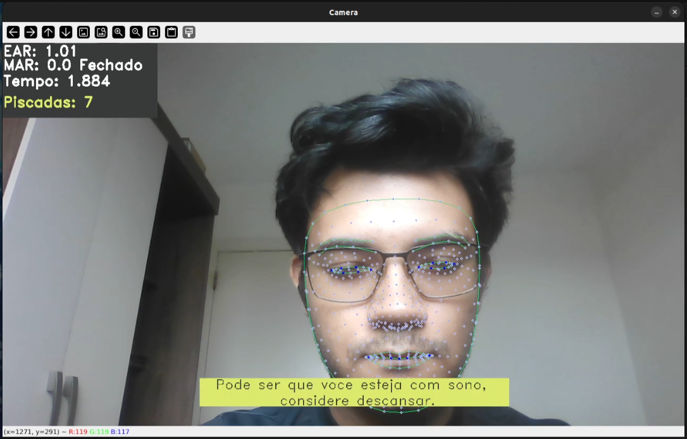

# 😴 Drowsiness Detection - Detecção de Sonolência com Visão Computacional



## 📝 Descrição

Este projeto é uma aplicação de visão computacional em tempo real para detectar sinais de sonolência. Utilizando uma webcam, o sistema monitora os olhos do indivíduo para identificar piscadas lentas ou o fechamento dos olhos por um período prolongado, que são indicadores comuns de fadiga.

Ao detectar esses sinais, um alarme sonoro é acionado para alertar o usuário, com o objetivo de prevenir acidentes em situações que exigem atenção constante, como dirigir.

## 😴 Demonstração

No vídeo abaixo, demonstramos o sistema em funcionamento. Observe como o alarme é ativado quando os olhos permanecem fechados por um tempo determinado.

*(Clique na imagem para ver o vídeo de demonstração)*

<a href="demo-sonolencia.mp4" title="Clique para assistir">
    
</a>


## 🚀 Tecnologias Utilizadas

O projeto foi desenvolvido utilizando as seguintes tecnologias:

-   **Python:** Linguagem de programação principal.
-   **OpenCV:** Biblioteca de visão computacional para captura e processamento de imagem e vídeo em tempo real.
-   **Dlib:** Biblioteca utilizada para a detecção de marcos faciais (*facial landmarks*), essencial para localizar a região dos olhos com precisão.
-   **Scipy:** Utilizada para cálculos espaciais, como a distância euclidiana entre os pontos dos olhos para calcular o *Eye Aspect Ratio (EAR)*.

## ⚙️ Como Funciona

O algoritmo segue os seguintes passos:

1.  **Captura de Vídeo:** A webcam captura o vídeo em tempo real.
2.  **Detecção de Face:** O algoritmo detecta a presença de um rosto em cada quadro do vídeo.
3.  **Detecção de Marcos Faciais:** Uma vez que o rosto é encontrado, o Dlib é usado para mapear 68 pontos-chave (marcos faciais) no rosto, incluindo os contornos dos olhos, sobrancelhas, nariz e boca.
4.  **Cálculo do EAR (Eye Aspect Ratio):** Com os pontos dos olhos localizados, calculamos a "proporção de aspecto do olho" (EAR). Este valor é alto quando o olho está aberto e se aproxima de zero quando o olho está fechado.
5.  **Análise de Sonolência:** O sistema monitora o valor do EAR. Se ele permanecer abaixo de um limiar por um número consecutivo de frames (indicando que o olho está fechado por muito tempo), o sistema classifica como um evento de sonolência.
6.  **Acionamento do Alarme:** Ao detectar sonolência, um alarme sonoro é disparado para alertar o usuário.

## 💡 Aplicações

Este sistema pode ser aplicado em diversas áreas para aumentar a segurança e o bem-estar:

-   **Segurança Automotiva:** Integrado em veículos para alertar motoristas sonolentos e prevenir acidentes de trânsito.
-   **Operadores de Maquinário Pesado:** Monitorar operadores para evitar acidentes de trabalho causados por fadiga.
-   **Controladores de Tráfego Aéreo:** Garantir que os controladores permaneçam alertas durante seus turnos.
-   **Sistemas de Monitoramento de Segurança:** Assegurar que o pessoal de segurança esteja atento.

## 🛠️ Como Executar o Projeto

Para executar este projeto em sua máquina local, siga os passos abaixo:

1.  **Clone o repositório:**
    ```bash
    git clone git@github.com:florindorian/drowsiness-detection.git
    cd drowsiness-detection
    ```

2.  **Instale as dependências:**
    É recomendado criar um ambiente virtual.
    ```bash
    pip install -r requirements.txt
    ```
    *(Certifique-se de ter um arquivo `requirements.txt` com as bibliotecas `opencv-python`, `dlib`, `scipy` e `numpy`)*.

3.  **Execute o script principal:**
    ```bash
    python app.py
    ```

---

## 👨‍💻 Autor

<a href="https://github.com/florindorian"></a>